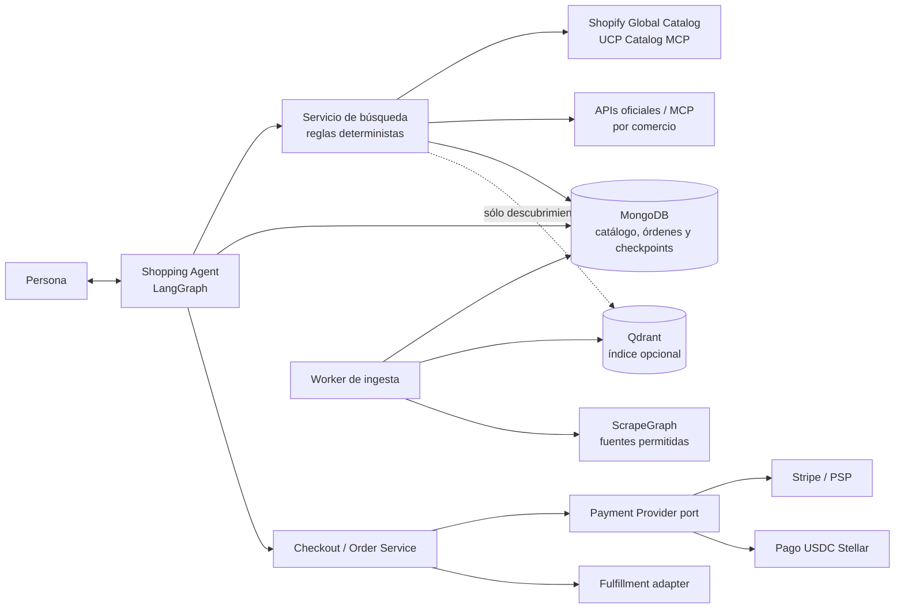

# Diseño propuesto: comercio asistido por agentes de IA

Estado: la arquitectura de comercio sigue siendo una propuesta. La primera
etapa del backend interno de pago Stellar Testnet está implementada según
`stellar-payments-plan.md`; checkout y el contrato público de comercio siguen
pendientes. `PAYMENTS_ENABLED` está apagado por defecto y no se habilitan compras
reales.

## Objetivo y límites

Permitir que una persona exprese una necesidad en lenguaje natural, compare
ofertas de varios comercios y llegue a una cotización verificable. El sistema
puede completar una compra solo después de una aprobación explícita en la
primera versión. El catálogo, el precio final, el stock, los permisos y el
estado de la orden los determina código de aplicación y el comercio, nunca el
LLM.

El producto se organiza en dos capas principales:

1. **Agente de Compras (Shopping Agent):** conversa con la persona, administra
   intención y estado durable, pide aclaraciones, presenta opciones y espera
   selección o aprobación.
2. **Descubrimiento de productos y precios (Search Agent):** consulta fuentes,
   normaliza, deduplica, revalida los candidatos y produce cotizaciones
   reproducibles.

El pago y la creación/fulfillment de la orden son capacidades deterministas
llamadas por el flujo de compra; no son decisiones delegadas al agente.

## Arquitectura

Las flechas representan dependencias lógicas; no implican que todos los
proveedores estén habilitados en el MVP. Los contratos internos aíslan
proveedores de las capas de servicio.

### Capa 1: Shopping Agent

- LangGraph.js modela pasos, reanudación, estado y pausas para selección o
  aprobación humana.
- `ShoppingState` conserva `sessionId`, estado, intención normalizada,
  candidatos mostrados, selección, cotización pendiente y referencias a
  checkout/orden. No conserva secretos de pago ni datos de tarjeta.
- El estado durable del grafo y la conversación se guardan en MongoDB mediante
  `@langchain/langgraph-checkpoint-mongodb` y su driver. Este adaptador todavía
  no está instalado en el repo.
- Nodos LLM: interpretar lenguaje, generar consultas candidatas y explicar
  diferencias entre ofertas con los datos recibidos.
- Nodos deterministas: validar el DTO, aplicar límites, buscar, filtrar ofertas,
  sumar importes, crear la cotización, comprobar aprobación y avanzar estados.
- El modelo no puede inventar atributos ausentes, alterar una cotización,
  escoger un método de pago no permitido, autorizar un importe distinto ni
  ejecutar herramientas fuera de la allowlist del usuario/tenant.

Estados de conversación propuestos:

`understanding -> searching -> awaiting_selection -> quoting ->
awaiting_approval -> authorized -> completed`; las salidas de error conducen a
`failed`, y una persona puede volver a `understanding` o cancelar mientras no se
haya confirmado la orden.

Persistir el estado del grafo no convierte el grafo en fuente autoritativa de
la transacción: órdenes, pagos y stock tienen colecciones propias en MongoDB o
estado en el proveedor correspondiente.

### Capa 2: Search Agent y catálogo

El Search Agent recibe `ProductSearchRequest` y coordina fuentes en paralelo,
con timeouts, límites por fuente, aislamiento de errores y normalización común.

Orden propuesto de fuentes:

1. Shopify Global Catalog MCP para descubrimiento multi-comercio Shopify y
   lookup de productos/variantes. Requiere perfil UCP del agente. Sus datos
   inferidos se tratan como señales de descubrimiento, no como afirmaciones del
   vendedor.
2. Catálogo local MongoDB para productos/ofertas de comercios integrados y
   datos canónicos que controle StellarMVP.
3. APIs oficiales o MCP de comercios adicionales, priorizando proveedores con
   autorización y política de uso documentadas.
4. Scraping asíncrono y controlado como fallback, nunca como fuente de precio o
   stock final de checkout.

El índice vectorial (Qdrant, ya instalado) es opcional y sirve únicamente para
recuperar candidatos semánticos. Nunca fija precio, stock, variante, impuestos,
envío ni aptitud de compra. Se vuelve a consultar la fuente autoritativa antes
de presentar la cotización final.

Normalización mínima de `ProductOffer`:

| Campo | Regla |
| --- | --- |
| `productId`, `merchantId` | Identidad estable de producto/variante y vendedor |
| `title`, `description`, `brand`, `model`, `gtin`, `sku` | Texto/datos fuente; marcar valores inferidos y procedencia |
| `price`, `currency` | Importe decimal exacto en unidades menores, no `number` binario |
| `availability` | `in_stock`, `out_of_stock`, `limited` o `unknown` |
| `shippingCost`, `taxes`, `totalCost` | Componentes separados; total calculado en servidor |
| `url`, `source`, `fetchedAt` | Procedencia y antigüedad de la oferta |
| `deliveryEstimate`, `returnPolicyUrl` | Opcionales; no inferir sin respaldo de fuente |

El Query Planner puede usar LLM para proponer variaciones de consulta. El
fan-out, los filtros duros (presupuesto, país, moneda, marca, disponibilidad),
la deduplicación, la cotización y el orden final los ejecuta código
determinista. La explicación al usuario solo puede apoyarse en los campos
normalizados disponibles.

### Datos e ingesta

- **MongoDB:** estado/checkpoints del agente en colecciones separadas de
  `merchants`, `products`, `offers`, `quotes`, `checkouts`, `orders`,
  `payment_intents`, `payment_attempts` y eventos de dominio. Índices únicos,
  transiciones condicionales y transacciones multidocumento donde hagan falta
  preservan idempotencia y consistencia. La retención de pagos/auditoría se
  define por separado de la de checkpoints conversacionales.
- **Qdrant:** índice derivado, reconstruible desde fuentes/catálogo y no
  autoritativo.
- **Worker asíncrono:** ingesta/refresh de comercios y scraping; con límites de
  coste, páginas y tiempo. No ejecutar crawling ni mantener una petición del
  usuario abierta mientras termina.

El worker debe bloquear loopback, redes privadas y link-local; resolver y
revalidar DNS/redirecciones; limitar tamaño, profundidad y duración; permitir
cancelación; registrar procedencia; y respetar políticas y condiciones de cada
fuente.

### Cotización, checkout y orden

`QuoteSnapshot` es inmutable y liga la selección del usuario a la compra:

- IDs de merchant, producto, variante y oferta fuente.
- Título/atributos presentados, cantidad y disponibilidad observada.
- Precio, moneda, envío, impuestos y total en la moneda de origen.
- Si se acuerda una comisión de plataforma, su pagador, base, importe,
  redondeo y destinatario se muestran y quedan ligados al snapshot aprobado.
  El diagrama inicial no define esa comisión; ver
  `stellar-payments-plan.md`.
- Si el pago requiere USDC: cantidad USDC, cotización FX, proveedor/origen,
  timestamp, expiración y regla de redondeo explícitos. No convertir con el LLM
  ni mantener el campo sugerido `totalAmountUSDC` sin fuente de tipo de cambio.
- URL de política, condiciones de entrega/devolución y `expiresAt`.
- `quoteId`, versión/hash de precio, tenant/usuario y estado de aprobación.

Antes de crear checkout, el servidor vuelve a validar precio, stock, variante,
destino e importe total con la fuente del merchant. Si algo cambia, invalida la
cotización y solicita selección/aprobación otra vez. La aprobación queda ligada
al hash exacto de la cotización; cualquier cambio requiere nueva aprobación.

El ciclo del checkout controla explícitamente: `created`, `ready_for_complete`,
`requires_buyer_input`, `requires_escalation`, `complete_in_progress`,
`completed` y `canceled`. El estado de pago y el estado de fulfillment se
modelan por separado. El merchant es autoridad del estado de checkout/orden y
el proveedor de pago de su estado de pago; una respuesta perdida se recupera
consultando el estado antes de reintentar.

Para checkout UCP, el agente puede ayudar a construir la sesión, pero la pauta
actual exige entregar el checkout a una interfaz determinista confiable para
que la persona revise los detalles y coloque la orden. Una futura compra
autónoma requeriría verificar otro perfil de plataforma/merchant y políticas de
delegación; no se infiere de la integración UCP de catálogo.

Invariantes:

- Clave de idempotencia estable para crear/completar checkout, crear intento de
  pago, capturar/liquidar y solicitar reembolso.
- Ninguna orden se marca pagada sin confirmación del proveedor/facilitador; no
  se confía en el texto o callback del agente.
- Ningún fulfillment se ejecuta dos veces por duplicación/reintento.
- Precio, merchant, línea, cantidad, moneda, importe máximo, red y destinatario
  del pago quedan ligados al mismo snapshot aprobado.
- No hay cargo adicional o incremento de importe silencioso.

### Pago: comercio vs. acceso a recursos

Separar dos usos que no deben compartir semántica:

- **Checkout de bienes/servicios:** Payment Provider port expone capacidades
  reales del proveedor elegido (por ejemplo, autorizar/capturar, liquidar,
  consultar, cancelar o reembolsar). Stripe/PSP o un payment handler UCP puede
  participar. No asumir que x402 implementa tarjeta, devolución, disputa,
  fulfillment o impuestos. Para el comercio piloto que acepte USDC en Stellar,
  usar el adaptador de pago descrito en `stellar-payments-plan.md`.
- **Cobro por consulta/recurso digital HTTP:** x402 puede proteger rutas
  seleccionadas y cobrar por request. `@x402/stellar` `exact` en Stellar
  testnet es candidato inicial, independiente de los pagos Stripe/base. No
  presentar x402 como checkout de carrito de mercancía ni suponer interoperar
  directamente con cada handler de pago UCP.

El adaptador presenta sus capacidades y límites; el caso de uso rechaza un
checkout si el método no cubre el ciclo requerido. Ninguna clave privada se
expone al grafo/LLM ni se guarda en MongoDB; las credenciales viven
en el gestor de secretos del runtime y el firmante debe poder limitarse por
red, destinatario, activo, monto y expiración.

## DTOs iniciales propuestos

Antes de implementar, convertir estos DTOs en schemas Zod con convenciones de
dinero seguras.

- `ShoppingIntent`: consulta, presupuesto máximo y moneda, país/ciudad de
  destino, marca/modelo y restricciones explícitas.
- `ProductSearchRequest`: consulta y filtros, límite acotado, destino, moneda y
  `inStock`.
- `ProductOffer`: oferta normalizada descrita arriba, con confianza/procedencia
  por campo cuando aplique.
- `QuoteSnapshot`: snapshot inmutable, conversión verificable, expiración,
  fuente y hash de aprobación.
- `ShoppingState`: estado durable de LangGraph y referencias de negocio, sin
  secretos ni credenciales de pago.

Los nombres y rutas HTTP del agente y checkout siguen siendo borrador; por SDD,
`specs/openapi.json` se cambia antes de implementar endpoints públicos. Las
rutas internas iniciales para intents de pago ya están declaradas allí.

## MVP recomendado y criterios

### Fase 0: validar integración y decisiones

- Hacer una prueba de lectura a Shopify Global Catalog MCP y comprobar límites,
  profile requerido, política de datos y disponibilidad de variantes.
- Elegir merchant piloto, tipo de producto, país, moneda, settlement y dueño de
  la relación comercial; resolver explícitamente quién es merchant of record,
  responsable de impuestos, entrega, devoluciones y soporte.
- Verificar paquetes/compatibilidad de MongoDB checkpointer con Bun actual; no
  añadirlo hasta correr un smoke test de LangGraph con checkpoint y resume.

### Fase 1: sandbox de extremo a extremo

- Solo catálogo global Shopify y un catálogo local de prueba; máximo 5 ofertas.
- Producto digital o servicio simple de merchant único; sin scraper sin
  permiso y sin promesa de envío multi-comercio.
- Shopping Agent persistente, selección y aprobación humana explícita.
- Cotización con expiración y precio/stock revalidados; Payment Provider mock;
  crear orden idempotente y fulfillment simulado.
- Sin fondos reales, claves mainnet, pagos autónomos ni auto-compra.

### Fase 2: proveedor de pago piloto

La primera etapa del backend para Stellar Testnet está implementada: quote
aprobada, intent idempotente, XDR clásico, firma humana y conciliación. Para
completar el piloto falta conectar checkout/productor de cotizaciones y
frontend-wallet, y probarlo end-to-end tras decidir settlement del merchant.
Si se exige el límite on-chain del diagrama, añadir y probar la smart account
Soroban. x402 `exact` queda para cobros HTTP por recurso; tarjeta/Stripe es otra
integración y no implica settlement en Stellar.

### Criterios de salida antes de producción

- El agente sobrevive reinicios y puede reanudar selección/aprobación sin
  duplicar checkout, orden, cargo o fulfillment.
- La cotización coincide con validación de merchant y matemáticas en unidades
  menores; variación invalida aprobación.
- Las políticas de gasto se evalúan de forma determinista y todo pago tiene
  usuario/tenant, merchant, purpose, amount, currency/network y expiración.
- Prompt injection en catálogo, URLs y contenido scrapeado no cambia
  herramientas permitidas ni política de pago.
- Telemetría permite correlacionar sesión, quote, order y payment attempt sin
  guardar secretos, PAN, claves ni PII innecesaria.
- Se prueban replay, duplicados, respuesta perdida, timeout de settlement,
  cotización expirada, stock agotado, cancelación, devolución y desconexión de
  proveedores.
- Si el proveedor no confirma pago, no se entrega el bien; si el pago confirmó
  pero fulfillment falla, se crea caso de compensación/reembolso y alerta.

## Pendientes y decisiones abiertas

1. ¿El primer producto será catálogo multi-merchant/global o se limitará a un
   merchant Shopify? UCP Global Catalog es candidato de descubrimiento, pero no
   garantiza disponibilidad/compra de cualquier merchant o región.
2. ¿El producto de salida será solo software/servicios digitales o incluirá
   envío físico? Esto cambia checkout, dirección, impuestos, devolución y
   fulfillment.
3. ¿Quién contrata al merchant y quién responde legal/comercialmente ante el
   comprador? No construir marketplace, escrow ni custodia por inferencia.
4. El piloto técnico elegido es USDC en Stellar Testnet. Falta acordar qué
   checkout acepta el merchant, settlement de producción y quién cubre fees,
   impuestos, devolución y soporte.
5. ¿Se requiere auto-compra futura? Definir límites por merchant/categoría,
   presupuesto por compra y ventana, aprobación por incremento, revocación y
   auditoría antes de habilitarla.
6. ¿Qué datos de sesión se retienen, por cuánto tiempo y cómo se eliminan de
   MongoDB/checkpoints y logs?
7. ¿Qué fuentes retailer tienen API oficial/MCP, permiso contractual y cobertura
   Perú/LatAm? La lista en pautas es candidata, no una integración verificada.

## Dependencias existentes y faltantes

Ya instaladas: LangGraph, checkpointer PostgreSQL heredado, LLM
OpenAI-compatible, ScrapeGraph, Qdrant, `pg`, Stripe, Stellar SDK, x402
(Fastify/fetch/Stellar/EVM) y `mongodb`. La presencia del checkpointer y `pg` no
cambia la decisión de MongoDB para el diseño de comercio.

Faltan para esta arquitectura: `@langchain/langgraph-checkpoint-mongodb`, worker
de ingesta, servicios/repos de catálogo y comercio, adaptadores de fuente,
checkout y fulfillment, eventos y el flujo integral con la wallet. Los DTOs de
pago iniciales y sus rutas internas sí están declarados en OpenAPI. Instalar
una dependencia no habilita la función ni prueba compatibilidad.

## Referencias primarias

- [UCP: repositorio y capacidades](https://github.com/Universal-Commerce-Protocol/ucp).
- [UCP: Checkout](https://ucp.dev/specification/shopping/checkout/).
- [Shopify Global Catalog MCP](https://shopify.dev/docs/agents/catalog/global-catalog).
- [Shopify Catalog APIs](https://shopify.dev/docs/agents/catalog).
- [x402 v2: especificación](https://github.com/x402-foundation/x402/blob/main/specs/x402-specification-v2.md).
- [Stellar x402 quickstart](https://developers.stellar.org/docs/build/agentic-payments/x402/quickstart-guide).
- [LangGraph JS: persistencia](https://github.com/langchain-ai/langgraphjs/blob/main/docs/docs/concepts/persistence.md).
- [MongoDB LangGraph.js checkpointer](https://www.mongodb.com/docs/atlas/ai-integrations/langgraph-js/).
